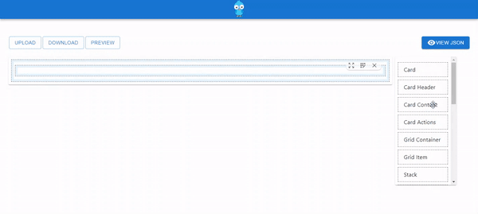

# Bombie — React Drag-and-Drop UI Builder

<p align="center">
  
</p>

> [!WARNING]
> **Experimental — not production ready.** Bombie is a personal demo
> project deployed to GitHub Pages for show-and-tell. Several features are
> partial (e.g. Upload / Download JSON in the toolbar are still placeholders),
> the dependency tree is still being trimmed, and breaking changes can land
> any time. Use the live demo to explore — don't ship products with it.

**🔗 Live demo:** https://amith-moorkoth.github.io/bombie/

## What it does

Bombie is a drag-and-drop builder for Material-UI components in React. Drop
elements onto a canvas, edit their props in a grouped property dialog,
preview the result responsively, and serialize the whole tree to JSON.

### Key features

- **40+ draggable Material-UI components** across five categories (Layout,
  Form Elements, Data Display, Feedback, Navigation).
- **Schema-driven property editor** — open the wrench icon on any canvas
  component and get a grouped, exhaustive form (variant / color / size /
  state / behavior / etc.) instead of a single text field.
- **Live preview in an iframe** with **Mobile / Tablet / Desktop** viewport
  toggles — MUI Grid breakpoints react to the iframe's viewport, so the
  responsive behavior you see matches what end-users will get.
- **Dialog as a real modal** in preview — Bombie renders a trigger button
  and an actual MUI Dialog; click any button inside it to close. The
  builder canvas keeps the dialog body flat so you can still edit it.
- **Sample templates** — four starters that load into the canvas with one
  click: Sign-in card, Stats dashboard, Settings panel, FAQ & support
  (accordion + dialog).
- **GitHub Pages SPA shim** — `public/404.html` + `spa-redirect.js` so
  deep-linked routes (`/generate-component`) survive a refresh.
- **CSP that adapts to mode** — strict `script-src 'self'` in production,
  `'unsafe-eval'` only in dev (for webpack-dev-server's HMR client).

## Quick start

```bash
git clone https://github.com/amith-moorkoth/bombie.git
cd bombie
cp .env.example .env       # adjust PUBLIC_URL_PATH / API_PROXY_TARGET
npm install
npm start                  # opens http://localhost:8080/
```

The builder lives at `/generate-component`. On Windows you can also
double-click [run.bat](run.bat) which handles the `.env` copy + `npm install`
for you.

## Scripts

| Command                  | Purpose                                          |
| ------------------------ | ------------------------------------------------ |
| `npm start`              | Webpack dev server with HMR                      |
| `npm run build`          | Production bundle to `dist/`                     |
| `npm run analyze`        | Production build with `bundle-report.html`       |
| `npm run lint`           | ESLint over `src/`                               |
| `npm run format`         | Prettier write over `src/`                       |
| `npm test`               | Jest (unit + component tests)                    |
| `npm run test:watch`     | Jest in watch mode                               |
| `npm run test:coverage`  | Jest with coverage report                        |
| `npm run deploy`         | Build and publish `dist/` to `gh-pages`          |

## Environment

Copy `.env.example` to `.env` and edit:

- `PUBLIC_URL_PATH` — asset prefix and router basename. Use `/` for root
  domains, `/<repo>/` for GitHub Pages project sites (this repo deploys
  with `PUBLIC_URL_PATH=/bombie/`).
- `API_PROXY_TARGET` — where the dev server proxies `/api/*` (dev only).
- `DEV_SERVER_PORT` — dev server port (default `8080`).

## Architecture

```
src/
├── App.js                              app shell, routes, theme, error boundary
├── index.js                            React 18 createRoot bootstrap
├── Controller/
│   ├── ComponentGenerator/             provider for the builder state
│   └── Home/                           landing route
├── Layout/                             route layout shells (header, 404)
├── Lib/
│   ├── ComponentGenerator/             builder feature
│   │   ├── Container/                  drop-target canvas + element recursion
│   │   │   └── UI/                     one file per palette component
│   │   │       └── Common/             factories + schema-driven property panel
│   │   ├── DragBox / DropBox/          react-dnd primitives
│   │   ├── Data/                       element catalog + types
│   │   ├── Elements/                   palette UI + icon map
│   │   ├── Preview/                    iframe-based responsive preview
│   │   ├── Samples/                    pre-built templates + load-into-builder UI
│   │   ├── bombie-context.js           shared state context
│   │   └── index.js                    builder screen
│   ├── ErrorBoundary/                  top-level error UI
│   └── Utils/
│       ├── http.js                     fetch wrapper with timeout + HttpError
│       ├── json-handler.js             recursive tree mutation helpers
│       └── js-dom-controller.js        nested object get/set by dot path
```

The whole UI is serialized as a tree of `{ id, info, props, child[] }` nodes.
[json-handler.js](src/Lib/Utils/json-handler.js) walks and mutates that tree;
[Container/element-recursion.js](src/Lib/ComponentGenerator/Container/element-recursion.js)
renders it for the builder; [Preview/render-preview.js](src/Lib/ComponentGenerator/Preview/render-preview.js)
renders the clean MUI tree for the live preview.

### Adding a new component

1. **Catalog**: add a `tag` + display name to
   [Data/element-base.js](src/Lib/ComponentGenerator/Data/element-base.js)
   and a row to [Data/elements.js](src/Lib/ComponentGenerator/Data/elements.js)
   with `type` (where it can be dropped) and `accept` (what it accepts).
2. **Builder UI**: write a file under
   [Container/UI/](src/Lib/ComponentGenerator/Container/UI/) using
   `makeLeafComponent` or `makeContainerComponent` from
   [UI/Common/make-component.js](src/Lib/ComponentGenerator/Container/UI/Common/make-component.js).
   Declare a `schema` (grouped props for the editor) and a `render` (the JSX).
3. **Wire it**: import + add to the REGISTRY in
   [Container/element-render.js](src/Lib/ComponentGenerator/Container/element-render.js).
4. **Icon + palette**: add an entry to
   [Elements/icon-map.js](src/Lib/ComponentGenerator/Elements/icon-map.js)
   and append the tag to the right CATEGORY in
   [Elements/index.js](src/Lib/ComponentGenerator/Elements/index.js).
5. **Preview**: add a branch to the `RENDERERS` switch in
   [Preview/render-preview.js](src/Lib/ComponentGenerator/Preview/render-preview.js).

That's it — ~5 small edits per component.

## Deploying to GitHub Pages

This repo includes [.github/workflows/deploy.yml](.github/workflows/deploy.yml)
which builds with `PUBLIC_URL_PATH=/bombie/` and publishes via
`actions/deploy-pages@v4` on every push to `main`. You can also publish
manually with:

```bash
PUBLIC_URL_PATH=/bombie/ npm run deploy
```

[public/404.html](public/404.html) + the inline script in
[public/spa-redirect.js](public/spa-redirect.js) make deep links
(`/generate-component`, `/anything-else`) survive page refreshes on
GitHub Pages — they redirect through a query-string round-trip that
React Router restores on load.

### Setting up GitHub Pages for your fork

1. Repo **Settings → Pages → Source** = `GitHub Actions`.
2. Push to `main` (or run the **Deploy to GitHub Pages** workflow manually).
3. After ~1 minute your demo is live at
   `https://<your-username>.github.io/<your-repo>/`.
4. Update `PUBLIC_URL_PATH` in `.github/workflows/deploy.yml` to match
   your repo name.

## Contributing

See [CONTRIBUTING.md](CONTRIBUTING.md) for the dev loop, lint/test commands,
and commit conventions.

## License

ISC. See [package.json](package.json).
