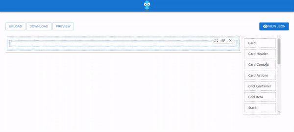

# Bombie - React Drag and Drop UI Builder Toolkit


<p align="center">
  
</p>

## Project Description

Bombie is a drag-and-drop builder for Material-UI components in React, designed to streamline the creation of React components through an intuitive interface. This tool allows users to visually assemble Material-UI components and generate corresponding React code, significantly simplifying the development process.

### Key Features

- **Drag-and-Drop Interface:** Easily drag and drop Material-UI components to build complex UIs.
- **Code Generation:** Automatically generate React component code based on the visual layout.
- **Component Customization:** Customize properties of Material-UI components directly within the interface.
- **Real-time Preview:** View the real-time preview of the UI as you build and customize components.

### Installation and Setup

1. **Clone the Repository:**
   ```bash
   git clone https://github.com/amith-moorkoth/bombie.git


2. **Navigate to the Project Directory: 
   ```bash
   cd bombie
3. **Install Dependencies:  
   ```bash
   npm install
4. **Start the Development Server: 
   ```bash
    npm start
5. **Access the Application: Open your browser and navigate to http://localhost:8080/generate-component to start using Bombie.
  
<p align="center">
  <br/>
  <b>Form Engine Builder</b>
</p>

# Note
This project is for demonstration purposes. For production usage, further optimization and development may be required.

# Support
Please consider supporting this project for further development. Stay tuned for updates!

# Little Documentation
<div id=":qj" class="Ar Au" style="display: block;"><div class="aO7"><div id=":qf" class="Am aiL Al editable LW-avf tS-tW tS-tY" hidefocus="true" aria-label="Message Body" g_editable="true" role="textbox" aria-multiline="true" contenteditable="true" tabindex="1" style="direction: ltr; min-height: 40px;" spellcheck="false" aria-owns=":sz" aria-controls=":sz" aria-expanded="false"><ol style="margin: 12px 0px 0px; display: flex; flex-direction: column; gap: 12px; padding-inline-start: 24px; color: rgb(17, 17, 17); font-family: -apple-system, Roboto, SegoeUI, &quot;Segoe UI&quot;, &quot;Helvetica Neue&quot;, Helvetica, &quot;Microsoft YaHei&quot;, &quot;Meiryo UI&quot;, Meiryo, &quot;Arial Unicode MS&quot;, sans-serif; font-size: 16px; background-color: rgb(247, 247, 247);"><li><p style="padding: 0px; margin: 0px; word-break: break-word; display: inline;"><strong>Purpose and Features</strong>:</p><ul style="display: flex; flex-direction: column; gap: 12px; margin: 12px 0px 0px; padding-inline-start: 24px;"><li>Bombie is designed for creating React components using a JSON-based approach.</li><li>It leverages React DND (Drag and Drop) and Material UI.</li><li>The project is intended for demo purposes and is not recommended for production use.</li><li>Feedback is welcome to improve the toolkit.</li></ul></li><li><p style="padding: 0px; margin: 0px; word-break: break-word; display: inline;"><strong>Workflow Overview</strong>:</p><ul style="display: flex; flex-direction: column; gap: 12px; margin: 12px 0px 0px; padding-inline-start: 24px;"><li>The main entry point is&nbsp;<code style="white-space-collapse: preserve; margin: 0px 2px; padding: 1px 4px; box-sizing: border-box;">src/Controller/ComponentGenerator/index.js</code>, where the context provider for the entire application is set up.</li><li>The actual screen rendering happens in&nbsp;<code style="white-space-collapse: preserve; margin: 0px 2px; padding: 1px 4px; box-sizing: border-box;">src/Lib/ComponentGenerator/index.js</code>, which consists of two frames: Drawer and DND Provider.</li><li>The&nbsp;<strong>Drawer</strong>&nbsp;displays the JSON data generated through drag-and-drop interactions.</li><li>The&nbsp;<strong>DND Provider</strong>&nbsp;shows available elements that can be dragged and dropped into the Drawer for component design.</li><li>The recursive container (<code style="white-space-collapse: preserve; margin: 0px 2px; padding: 1px 4px; box-sizing: border-box;">src/Lib/ComponentGenerator/Container/element-recursion.js</code>) attaches the respective DOM elements based on requirements.</li></ul></li><li><p style="padding: 0px; margin: 0px; word-break: break-word; display: inline;"><strong>Why JSON-Based React Material Toolkit?</strong>:</p><ul style="display: flex; flex-direction: column; gap: 12px; margin: 12px 0px 0px; padding-inline-start: 24px;"><li>Bombie aims to address the need for drag-and-drop design functionality.</li><li>By storing React components as JSON in databases (e.g., MongoDB), developers can access them anywhere using a single library in React or JavaScript.</li><li>This approach optimizes performance and reduces page loading overhead.</li><li>Designers gain control over a significant portion of the development lifecycle.</li></ul></li></ol><p style="padding: 0px; margin: 12px 0px 0px; word-break: break-word; font-size: 16px; color: rgb(17, 17, 17); font-family: -apple-system, Roboto, SegoeUI, &quot;Segoe UI&quot;, &quot;Helvetica Neue&quot;, Helvetica, &quot;Microsoft YaHei&quot;, &quot;Meiryo UI&quot;, Meiryo, &quot;Arial Unicode MS&quot;, sans-serif; background-color: rgb(247, 247, 247);">For more details, you can explore the&nbsp;<a href="https://github.com/amith-moorkoth/bombie" class="gmail-ac-anchor" target="_blank" style="font-family: inherit; font-size: inherit; line-height: inherit; font-variation-settings: inherit; font-weight: inherit; text-decoration-line: none;">Bombie repository</a>.&nbsp;<a href="https://dev.to/amithmoorkoth/drag-and-drop-toolkit-for-react-material-ui-custom-made-json-based-react-forms-generator-2gi2" class="gmail-tooltip-target" target="_blank" style="color: inherit; border-bottom: 2px solid transparent; text-decoration-style: dotted; text-underline-offset: 3px;">If you have any specific questions or need further assistance, feel free to ask! </a><a href="https://dev.to/amithmoorkoth/drag-and-drop-toolkit-for-react-material-ui-custom-made-json-based-react-forms-generator-2gi2" class="gmail-ac-anchor gmail-sup-target" target="_blank" aria-label="1: Bombie repository" style=""><span class="gmail-citation-sup" style="display: inline-flex; align-items: center; justify-content: center; vertical-align: top; top: 4px; margin: 0px 2px; min-width: 14px; height: 14px; text-decoration-color: transparent; outline: transparent solid 1px; background: transparent;">1</span></a><a href="https://github.com/amith-moorkoth/bombie/blob/main/README.md" class="gmail-ac-anchor gmail-sup-target" target="_blank" aria-label="2: Bombie repository" style=""><span class="gmail-citation-sup" style="display: inline-flex; align-items: center; justify-content: center; vertical-align: top; top: 4px; margin: 0px 2px; min-width: 14px; height: 14px; text-decoration-color: transparent; outline: transparent solid 1px; background: transparent;">2</span></a>.</p></div><div id=":qk" class="n0NzRc"></div></div></div>
